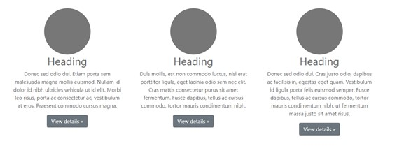
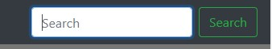
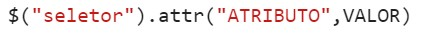
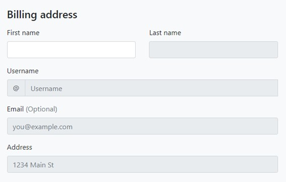
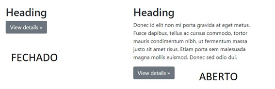
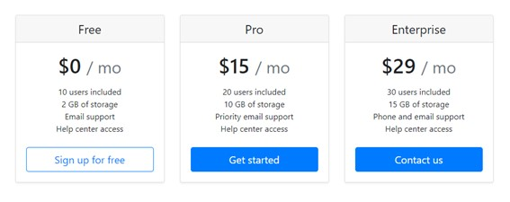

### Autor

<a href="https://www.linkedin.com/in/kadufloresta/">
 </b>
 
 <code><b>Kadu Floresta</b></code></a>
 
 <code><a href="https://github.com/KaduFloresta" title="HomeGit">🏠 GitHub - Home</a> </code> 
 <code><a href="https://github.com/KaduFloresta?tab=repositories" title="RepoGit">📂 GitHub - Repositórios</a> </code>

<code>👋🏽 Entre em contato!</code>

 

 
---

# HTML - CSS - Javascript - JQuery

## Avaliação JQuery
Para todos os exercícios, utilizar como base os códigos correspondentes às pastas: exer1, exer2, etc.

Criar um arquivo javascript separado que poderá ficar em /js
Nos exercícios em que não será possível alterar a estrutura do HTML, você ainda pode alterar os conteúdos se preferir (imagens, textos, links, etc).

**1º. Exercicío**
   
    A) Sem alterar nada diretamente no HTML e CSS, apenas utilizando jQuery, modifique as colunas da imagem abaixo para que iniciem com opacidade 0.5 e fiquem com opacidade 1 ao passar o mouse em cima.

  
    
    B) Utilizando apenas jQuery, crie uma lógica para que ao carregar a tela só a navbar apareça e que o resto da página apareça quando o valor “mostrar” for digitado no campo de busca (sem necessariamente clicar no botão search). Não esqueça de validar se o valor “mostrar” for alterado para outro. O resto da página SÓ deve aparecer quando o valor “mostrar” estiver escrito no input search.

**2º Exercicío**

    Utilizando o método attr(), conforme exemplo abaixo, deixa apenas o campo First Name habilitado, todos os outros devem ficar disabled até que o valor digitado em First Name seja diferente de vazio.
 

    Como deve ficar: 
 

**3º Exercicío**	
   
    Modifique o que for necessário de HTML e crie um evento em jQuery para que o texto abaixo de heading só apareça ao clicar em “view details”. Utilize sliding.
 

 

**4º Exercicío**

    Desenvolva uma lógica para que, ao clicar no botão “Toggle Navbar”, a navbar seja posicionada no topo ou no final da página (intercalando as posições).

**5º Exercicío**

    Desenvolva uma lógica para que, ao clicar em um dos botões, as outras opções desapareçam esmaecendo (velocidade 5000 milissegundos) e a respectiva coluna fique com tamanho 8.
 
 

 
**6º Exercicío**

    Desenvolva uma lógica para deslocar as headlines 50px para a direita ou esquerda (se for uma da direita, deslocar para a esquerda e vice-versa) quando o mouse entra no elemento (toda a div ) e volte à posição inicial quando o mouse sai.

**DIVIRTA-SE!!!**
